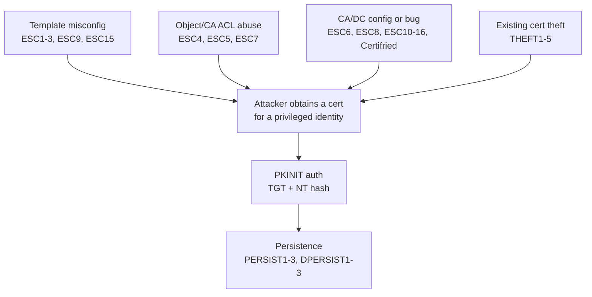
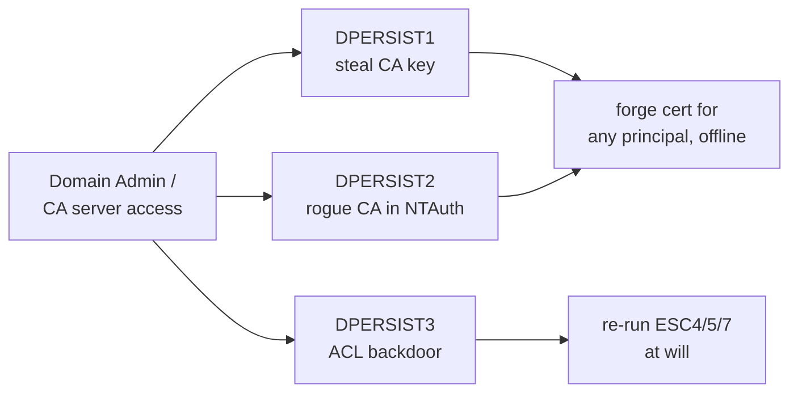
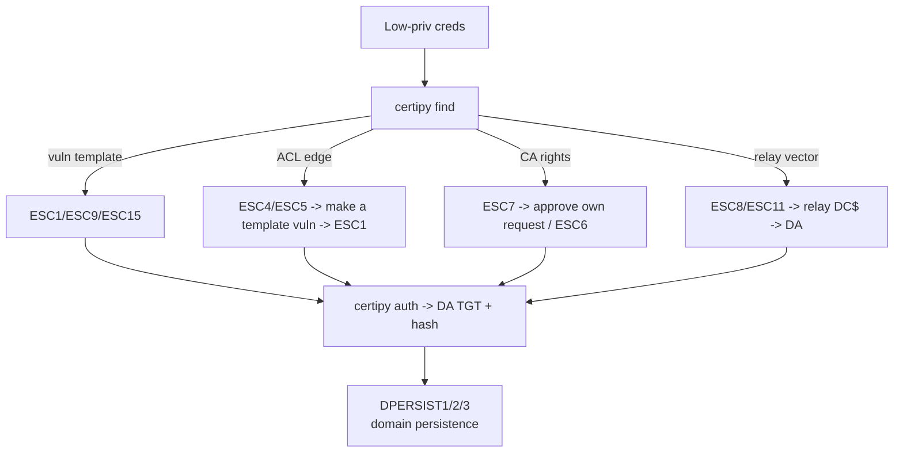

# ADCS Attack Methodology

> **Purpose —** How an ADCS engagement flows from enumeration through escalation, credential theft, and domain persistence. Follows the SpecterOps **Certified Pre-Owned** taxonomy: **ESC** (escalation), **THEFT** (credential theft), **PERSIST** (account persistence), **DPERSIST** (domain persistence).

## 1. The ADCS Attack Surface

Active Directory Certificate Services binds a cryptographic identity (a certificate) to an AD principal. The moment a certificate can carry an *authentication* EKU and an attacker can influence *whose* identity is stamped into it, the certificate becomes a password-equivalent that survives password resets. Four things go wrong:



> **Why certificates are dangerous —** A stolen or forged authentication certificate is valid until it **expires** (often 1–5 years) or is **revoked**. Password changes do not invalidate it. Forged certs (Golden Certificate, rogue CA) are never seen by the CA's issuance pipeline, so they **cannot be revoked**.

## 2. Phase 1 — Enumeration

Everything starts with `certipy find`. Do this before anything else.

```bash
# Full enumeration, only show vulnerable, print to terminal + save JSON/BloodHound
certipy-ad find -u 'lowpriv@domain.htb' -p 'Password123!' \
  -dc-ip $TARGET -vulnerable -stdout

# Pass-the-hash variant
certipy-ad find -u 'lowpriv@domain.htb' -hashes :NTHASH -dc-ip $TARGET -vulnerable -stdout

# Enumerate everything (not just vulnerable) — useful for THEFT/PERSIST target hunting
certipy-ad find -u 'lowpriv@domain.htb' -p 'Password123!' -dc-ip $TARGET -stdout
```

Three registry/patch checks decide whether the mapping-based attacks work:

```bash
# StrongCertificateBindingEnforcement on the DC (0=off, 1=compat[default], 2=full)
nxc smb $TARGET -u user -p pass \
  -x 'reg query "HKLM\SYSTEM\CurrentControlSet\Services\Kdc" /v StrongCertificateBindingEnforcement'

# CertificateMappingMethods (ESC10 — 0x4 = weak UPN mapping enabled)
nxc smb $TARGET -u user -p pass \
  -x 'reg query "HKLM\SYSTEM\CurrentControlSet\Control\SecurityProviders\Schannel" /v CertificateMappingMethods'

# Patch level (Certifried KB5014754, EKUwu KB5044281)
nxc smb $TARGET -u user -p pass -x 'wmic qfe list brief | findstr "KB5014754 KB5044281"'
```

> **Tip — feed BloodHound.** `certipy find` writes a BloodHound-compatible zip. Import it to see ACL edges to PKI objects (drives ESC4/ESC5/ESC7 and DPERSIST3).

## 3. Phase 2 — Escalation (ESC)

Classify the finding, then jump to the technique. The generic escalation loop is always the same three Certipy verbs:

```bash
# 1. request a cert for a privileged identity (technique-specific flags)
certipy-ad req  -u me -p pass -ca 'CA-NAME' -template 'TEMPLATE' -upn 'administrator@domain.htb'
# 2. authenticate the cert -> TGT + NT hash (PKINIT + UnPAC-the-hash)
certipy-ad auth -pfx administrator.pfx -dc-ip $TARGET
# 3. use the TGT or hash
export KRB5CCNAME=administrator.ccache && impacket-wmiexec -k -no-pass DC01.domain.htb
```

The ESC family answers "how do I get a cert for someone I shouldn't." Quick routing:

| If certipy shows... | Technique |
| :-- | :-- |
| `Enrollee Supplies Subject: True` + auth EKU | ESC1 — SAN specification in template |
| `Any Purpose` / `No EKU` | ESC2 — Any Purpose EKU / No EKU (the Swiss certificate) |
| `Certificate Request Agent` EKU | ESC3 — misconfigured enrollment agent templates |
| Dangerous ACE on template | ESC4 — vulnerable certificate template access control |
| Write ACE on PKI object | ESC5 — vulnerable PKI object access control |
| `User Specified SAN: Enabled` (CA) | ESC6 — EDITF_ATTRIBUTESUBJECTALTNAME2 flag |
| `ManageCA` / `ManageCertificates` | ESC7 — vulnerable CA access control |
| `Web Enrollment: Enabled` | ESC8 — NTLM relay to ADCS HTTP web enrollment |
| `No Security Extension` (template) | ESC9 — no security extension (template-level) |
| Weak DC mapping registry | ESC10 — weak certificate mapping |
| `IF_ENFORCEENCRYPTICERTREQUEST: Disabled` | ESC11 — NTLM relay to ADCS RPC (ICPR) |
| YubiHSM on CA | ESC12 — shell access to CA with YubiHSM |
| Issuance policy OID group link | ESC13 — issuance policy OID group link |
| Weak `altSecurityIdentities` mapping | ESC14 — weak explicit certificate mapping |
| Schema v1 + unpatched CA | ESC15 — EKUwu (CVE-2024-49019) |
| `DisableExtensionList` on CA | ESC16 — security extension disabled on CA (globally) |
| WSUS + Server Auth template | ESC17 — ADCS certificate spoofing vs HTTPS-enabled WSUS clients |
| MachineAccountQuota ≥ 1 + unpatched DC | Certifried (CVE-2022-26923) |

## 4. Phase 3 — Credential Theft (THEFT)

Once you have a foothold, harvest certificates that already exist rather than requesting new ones. Often quieter than an ESC, and yields keys for users/machines that have already enrolled.

| Technique | Target | Note |
| :-- | :-- | :-- |
| THEFT1 — export cert + private key via CryptoAPI | Exportable (or force-exportable) keys in a user's store | |
| THEFT2 — user certificate theft via DPAPI | `%APPDATA%\Microsoft\Crypto` + masterkeys | |
| THEFT3 — machine certificate theft via DPAPI | SYSTEM store, machine masterkeys | |
| THEFT4 — finding certificate files on disk | `.pfx .p12 .pem .key`, unattend.xml | |
| THEFT5 — NT hash via PKINIT (UnPAC-the-hash) | Any cert you can authenticate with | |

## 5. Phase 4 — Using Certificates (PKINIT)

A certificate with an authentication EKU is spent through **PKINIT** to obtain a Kerberos TGT, and optionally the account's NT hash via **UnPAC-the-hash** (U2U). This is the pivot between "I have a .pfx" and "I have a shell."

```bash
# Certipy does PKINIT + UnPAC in one step
certipy-ad auth -pfx target.pfx -dc-ip $TARGET
#   -> target.ccache (TGT)  AND  the account's NT hash

# Windows equivalent (Rubeus)
.\Rubeus.exe asktgt /user:target /certificate:target.pfx /getcredentials /nowrap
```

> **Warning — clock skew breaks PKINIT.** Certificate auth is Kerberos, so it is time-sensitive. If `certipy auth` throws `KRB_AP_ERR_SKEW`, wrap it with faketime:
> ```bash
> faketime -f '+7h30m' certipy-ad auth -pfx target.pfx -dc-ip $TARGET
> ```

> **Tip — Pass-the-Certificate.** If the DC has no PKINIT support but does support Schannel/LDAPS, authenticate the cert over LDAP (`certipy auth -ldap-shell`) instead of Kerberos. Shadow Credentials (msDS-KeyCredentialLink abuse) uses the same PKINIT path with a key you plant yourself.

## 6. Phase 5 — Persistence (PERSIST / DPERSIST)

Certificates make excellent persistence because they outlive password resets.

**Account persistence** — keep access to one or more principals:

| Technique | Idea |
| :-- | :-- |
| PERSIST1 — active user cert | Enrol/steal a long-life cert for a user you control |
| PERSIST2 — machine account cert | Cert for a computer account survives the 30-day machine password rotation |
| PERSIST3 — certificate renewal | Renew before expiry using the existing key, no creds needed |

**Domain persistence** — forge auth for *anyone*; requires you first reach the CA private key or high privilege:

| Technique | Idea |
| :-- | :-- |
| DPERSIST1 — Golden Certificate | Steal CA private key, forge certs offline |
| DPERSIST2 — Rogue CA / NTAuth | Add an attacker CA to `NTAuthCertificates` and Root store |
| DPERSIST3 — malicious misconfiguration | Plant ESC4/5/7-style ACL backdoors on PKI objects |



## 7. Attack Chaining

Real engagements chain these. Common paths:



Worked chains:

- **ESC5 → ESC1:** you hold a write ACE over a PKI object, so you edit a template to enable `Enrollee Supplies Subject`, turning it into ESC1, then request an Administrator cert.
- **ESC8 → DA:** coerce the DC (PetitPotam) and relay its NTLM auth to the CA web-enrolment endpoint, minting a DC certificate, then DCSync.
- **ESC7 → ESC6-like:** with `ManageCA` you flip the `EDITF_ATTRIBUTESUBJECTALTNAME2` flag on the CA, enabling SAN injection on any template.
- **Shadow Credentials → PKINIT:** you have `GenericWrite` over a target, so you plant a Key Credential and authenticate as them without touching ADCS templates at all.

## 8. Defence & Detection

> **Detection focus —** Certificate abuse is quiet at the AD layer but leaves CA and KDC traces.

- **CA logs:** Event ID **4886** (request) and **4887** (issued). Alert when the SAN/UPN differs from the requester.
- **KDC logs:** Event ID **4768** (TGT) with certificate info; a 4768 without a preceding smart-card enrolment is suspicious.
- **Enforce strong binding:** `StrongCertificateBindingEnforcement = 2` on all DCs (blocks ESC1/6/9/10/16 UPN tricks).
- **Audit PKI ACLs:** review `NTAuthCertificates`, the Enrollment Services container, CA objects, and template DACLs for non-admin write (kills ESC4/5/7 and DPERSIST3).
- **Restrict enrolment:** remove `Domain Users` / `Authenticated Users` from authentication-capable templates; require manager approval where SAN is needed.
- **Protect the CA key:** HSM-backed keys defeat DPERSIST1 offline forgery.
- **Monitor** `msDS-KeyCredentialLink` writes (Shadow Credentials) and `altSecurityIdentities` writes (ESC14).

## 9. Full Technique Map

| Phase | Techniques | Prereq | Outcome |
| :-- | :-- | :-- | :-- |
| **Escalate** | ESC1–17, Certifried | Low-priv + a misconfig/bug/ACL | Cert for a privileged identity |
| **Steal** | THEFT1–5 | Host foothold | Existing keys / NT hash |
| **Use** | PKINIT auth | A `.pfx` with auth EKU | TGT + NT hash → shell |
| **Persist (account)** | PERSIST1–3 | Enrolment or a stolen cert | Long-life access to principals |
| **Persist (domain)** | DPERSIST1–3 | CA key or high privilege | Forge auth for anyone |
| **Adjacent** | Shadow Credentials | `GenericWrite`/`GenericAll` over target | Auth as target via planted key |

## Sources

- SpecterOps *Certified Pre-Owned* (Schroeder & Christensen)
- Certipy Wiki — https://github.com/ly4k/Certipy/wiki
- The Hacker Recipes — ADCS — https://www.thehacker.recipes/ad/movement/ad-cs/
