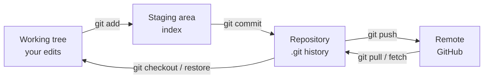
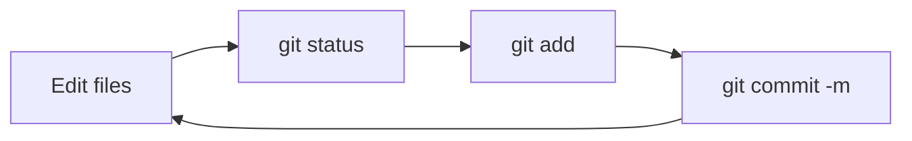
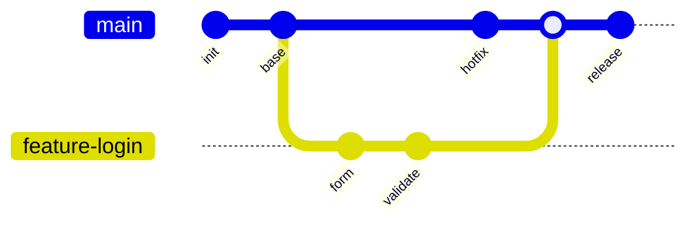
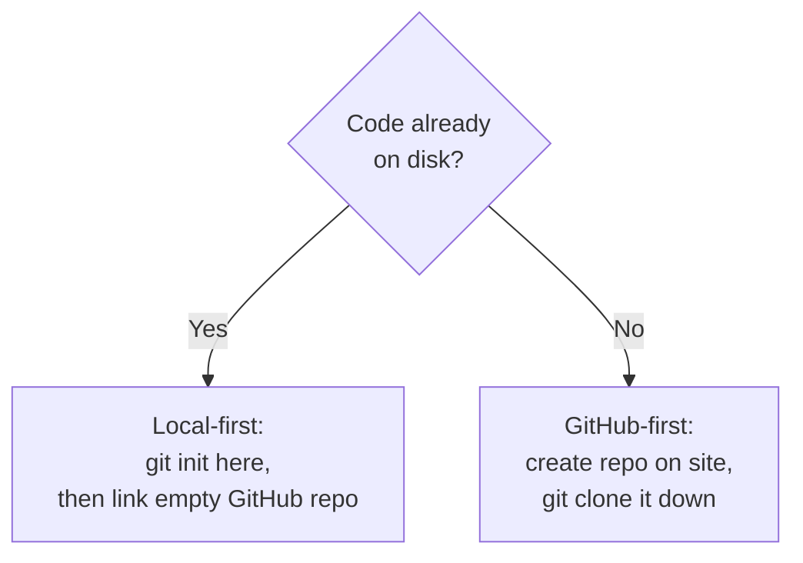
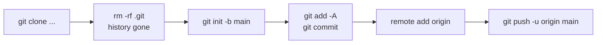
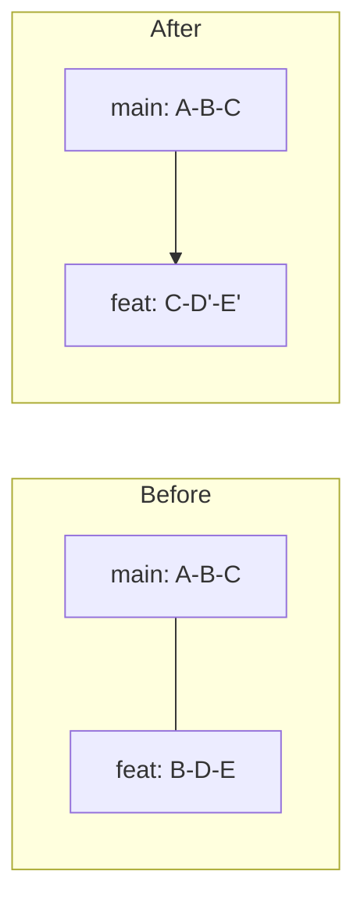

# Git

> **Scope —** Covers the full GitByBit core curriculum taught as *workflows* rather than a bare command list, plus a Real-World Workflows section (history wipe + re-publish, branch create/merge, conflict resolution). For deeper dives see Git Branching and Git Reset & Undo.

The mental model: Git tracks snapshots across three areas. Every command moves changes between them.



## 1. Intro & Setup

Git is a distributed version control system: every clone is a full repository with complete history. Before your first commit, tell Git who you are and set sane defaults.

```bash
# Identity (used in every commit) — --global writes to ~/.gitconfig
git config --global user.name  "Netrunner"
git config --global user.email "you@example.com"

# Make new repos use 'main' instead of 'master'
git config --global init.defaultBranch main

# Line endings: 'input' on Linux/macOS, 'true' on Windows
git config --global core.autocrlf input

# Handy quality-of-life
git config --global pull.rebase false          # merge on pull (default, explicit)
git config --global core.editor "nvim"         # editor for commit messages

git config --list                              # verify everything
```

> **Tip — Per-repo overrides:** Drop `--global` to set a value for the current repo only (e.g. a work email on a work project). Local config lives in `.git/config` and wins over global.

## 2. Getting Files Into the Repo

The core loop you'll run hundreds of times a day: **edit → status → add → commit**.

```bash
git init                    # turn a folder into a repo (creates .git/)
git init -b main            # ...and name the initial branch 'main'

git status                  # what's changed, staged, untracked — run this constantly
git status -s               # short format

git add file.py             # stage one file
git add src/                # stage a directory
git add -A                  # stage everything (new, modified, deleted)
git add -p                  # interactively stage hunks (great for clean commits)

git commit -m "Add login handler"       # commit staged changes with a message
git commit -am "Fix typo"               # add (tracked files) + commit in one step
git commit                              # opens editor for a multi-line message
```



> **Note — A good commit:** Stage related changes together and write a message in the imperative mood ("Add", "Fix", "Refactor") describing *why*, not just *what*. Use `git add -p` to split unrelated edits into separate commits.

**Ignoring files** — create a `.gitignore` before your first commit:

```bash
cat > .gitignore <<'EOF'
__pycache__/
*.pyc
.env
loot/
*.ccache
EOF
```

## 3. Resetting Unwanted Changes

Undo operations, from safest (working tree) to most destructive (history). Know which area you're touching. Full treatment in Git Reset & Undo.

```bash
# See exactly what changed before undoing anything
git diff                    # working tree vs staging (unstaged changes)
git diff --staged           # staging vs last commit (what a commit would include)

# Discard UNSTAGED changes in the working tree (irreversible)
git restore file.py         # modern
git checkout -- file.py     # older syntax, same effect

# Unstage a file (keep the edit, just remove from index)
git restore --staged file.py
git reset HEAD file.py      # older syntax

# Throw away ALL local uncommitted changes
git restore .
git reset --hard            # nukes working tree + index to last commit

# Remove untracked files/dirs (careful!)
git clean -n                # dry-run: show what would be deleted
git clean -fd               # force-delete untracked files and directories

# Fix the LAST commit (message or forgotten file)
git add forgotten.py
git commit --amend                       # opens editor to edit message too
git commit --amend --no-edit             # keep message, just add the file
```

> **Warning — `--amend` and `reset --hard` rewrite/discard:** `--amend` creates a *new* commit replacing the last one — never amend a commit you've already pushed to a shared branch. `reset --hard` permanently drops uncommitted work.

## 4. Tagging & Branching

A branch is just a movable pointer to a commit. Branching lets you develop a feature in isolation, then merge it back.

### Referencing commits & tags

```bash
git tag v1.0                         # lightweight tag on current commit
git tag -a v1.0 -m "First release"   # annotated tag (has message/author)
git tag                              # list tags
git push origin v1.0                 # push a tag (tags aren't pushed by default)
git push origin --tags               # push all tags

# Refer to commits: HEAD (current), HEAD~1 (one back), HEAD~3, or a hash
git show HEAD~2
```

### Creating & switching branches

```bash
git branch                       # list local branches (* = current)
git branch feature-login         # create a branch (doesn't switch)
git switch feature-login         # switch to it (modern)
git switch -c feature-login      # create AND switch in one step
git checkout -b feature-login    # older syntax, same as above

git switch main                  # go back to main
git branch -d feature-login      # delete a merged branch (safe)
git branch -D feature-login      # force-delete (unmerged — careful)
git branch -m old new            # rename a branch
```

### Merging branches



```bash
# 1. Finish work on the feature branch, commit it
git switch feature-login
git add -A && git commit -m "Add login form + validation"

# 2. Switch to the target branch and merge
git switch main
git merge feature-login          # brings the feature commits into main

# 3. Clean up
git branch -d feature-login
```

> **Tip — Fast-forward vs merge commit:** If `main` hasn't moved since you branched, Git just moves the pointer forward (fast-forward, no extra commit). If both diverged, Git creates a *merge commit*. Force a merge commit for a clear history with `git merge --no-ff feature-login`.

See Git Branching and Git Reset & Undo for advanced branch management.

## 5. History

Read the past, compare states, and undo old commits safely.

```bash
git log                              # full history
git log --oneline                    # compact, one line per commit
git log --oneline --graph --all      # visual branch/merge graph
git log --stat                       # files changed per commit
git log -p                           # show the actual diffs
git log --author="Netrunner" --since="2 weeks ago"

# Compare things
git diff main..feature-login         # difference between two branches
git diff HEAD~3 HEAD                 # last 3 commits' combined change
git show <hash>                      # one commit in full

# Who changed this line, and when
git blame file.py
```

### Undoing old commits — `revert` vs `reset`

```bash
# REVERT: safe, creates a NEW commit that undoes an old one. Use on shared branches.
git revert <hash>                    # undo one commit, keep history intact
git revert HEAD                      # undo the latest commit safely

# RESET: rewrites history by moving the branch pointer. Local branches only.
git reset --soft HEAD~1              # undo last commit, KEEP changes staged
git reset --mixed HEAD~1             # undo last commit, keep changes unstaged (default)
git reset --hard HEAD~1              # undo last commit AND discard its changes
```

> **Warning — revert = public, reset = private:** On a branch others have pulled, **always `revert`** — it adds history rather than rewriting it. Save `reset` for cleaning up local commits you haven't pushed.

## 6. Remotes & GitHub

A remote is a copy of the repo hosted elsewhere (usually GitHub). You sync with `push` and `pull`.

```bash
git clone https://github.com/USER/REPO.git       # copy a remote repo locally
git clone https://github.com/USER/REPO.git dir   # into a named folder

git remote -v                                     # list remotes
git remote add origin https://github.com/YOU/REPO.git   # link a remote named 'origin'
git remote set-url origin git@github.com:YOU/REPO.git   # switch HTTPS -> SSH

git push -u origin main          # first push: -u sets upstream tracking
git push                         # subsequent pushes (tracking already set)

git fetch                        # download remote changes WITHOUT merging
git pull                         # fetch + merge into current branch
git pull --rebase                # fetch + replay your commits on top (linear history)
```

> **Tip — SSH vs HTTPS + credentials:** HTTPS needs a Personal Access Token (not your password) since 2021. SSH (`git@github.com:...`) uses your key pair and avoids the prompt entirely. Set up a key with `ssh-keygen -t ed25519` and add the public key to GitHub.

> **Warning — Dangers of rewriting public history:** `git push --force` overwrites the remote branch and can destroy teammates' commits. Prefer `git push --force-with-lease`, which refuses if the remote moved since you last fetched. Never force-push shared branches like `main`.

## 7. Real-World Workflows

### 7a. Set up a brand-new repo (local + GitHub)

Two ways to start a fresh project. Pick based on whether the code already exists on your machine.



**Step 1 — create the repo on the GitHub website**

1. Go to **github.com → New** (the `+` menu, top-right) → **New repository**.
2. Name it (e.g. `voidwalker`), add a description, choose **Public** or **Private**.
3. **If you already have local code:** leave "Add a README / .gitignore / license" **unchecked** — an empty repo avoids a first-push conflict.
   **If you're starting fresh on GitHub:** tick README/.gitignore so there's something to clone.
4. Click **Create repository**. GitHub shows you the repo URL (HTTPS or SSH) — copy it.

**Path A — local-first (you already have files)**

```bash
cd ~/projects/voidwalker            # your existing project folder
git init -b main                    # start a repo, initial branch = main
git add -A                          # stage everything
git commit -m "Initial commit"      # first commit

# Link the empty GitHub repo you just made:
git remote add origin https://github.com/YOU/voidwalker.git
git remote -v                       # verify: origin -> your URL (fetch + push)

git push -u origin main             # -u sets upstream so later 'git push' just works
```

**Path B — GitHub-first (repo created with a README)**

```bash
git clone https://github.com/YOU/voidwalker.git   # brings repo down + wires origin
cd voidwalker
# ...add your files...
git add -A
git commit -m "Add project files"
git push                            # origin/main already tracked by clone
```

> **Tip — `git init` vs `git clone`:** `git init` makes a repo from a folder you already have and you wire the remote yourself with `git remote add`. `git clone` does init **plus** `remote add origin` **plus** the first fetch in one step. Use init when the code is local first, clone when it lives on GitHub first.

> **Warning — "Updates were rejected" on first push:** This means the GitHub repo already has commits (a README you added at creation) that your local repo doesn't. Either recreate the repo empty, or reconcile once:
> ```bash
> git pull --rebase origin main      # replay your commit on top of GitHub's README
> git push -u origin main
> ```

> **Note — Authentication reminder:** HTTPS pushes need a **Personal Access Token** (Settings → Developer settings → PAT), not your account password. Or switch to SSH:
> ```bash
> ssh-keygen -t ed25519 -C "you@example.com"   # then add ~/.ssh/id_ed25519.pub to GitHub
> git remote set-url origin git@github.com:YOU/voidwalker.git
> ```

### 7b. Clone a project, wipe its history, publish as your own

Strip all prior history (and any commit trailers) and start a clean repo under your account.

```bash
git clone https://github.com/DAEMON-404/voidwalker.py.git fresh
cd fresh
rm -rf .git                                   # wipes all history + trailers
git init -b main                              # -b main so it isn't "master"
git add -A
git commit -m "Initial commit"
git remote add origin https://github.com/YOU/NEWREPO.git
git push -u origin main
```



> **Warning — This is destructive and one-way:** `rm -rf .git` permanently deletes every commit, branch, and tag locally. Only do this when you deliberately want a clean slate. Make sure `origin` points at *your* new empty repo before pushing, or you'll try to overwrite the original.

> **Note — Alternative: keep files but squash to one commit:** If you'd rather keep the remote link but collapse history:
> ```bash
> git checkout --orphan clean      # new branch with no history
> git add -A && git commit -m "Initial commit"
> git branch -D main               # drop old branch
> git branch -m main               # rename clean -> main
> git push -f origin main          # force-replace remote history
> ```

### 7c. Feature branch, from creation to merged PR

```bash
git switch main && git pull            # start from an up-to-date main
git switch -c feature/xyz              # branch off

# ...work...
git add -A && git commit -m "Implement xyz"
git push -u origin feature/xyz         # publish the branch

# Open a Pull Request on GitHub (web UI), get it reviewed, then:
git switch main && git pull            # bring the merged change down locally
git branch -d feature/xyz              # delete local branch
git push origin --delete feature/xyz   # delete remote branch
```

### 7d. Resolving a merge conflict

```bash
git switch main
git merge feature/xyz
# CONFLICT (content): Merge conflict in app.py
```

Git marks conflicts inside the file:

```text
<<<<<<< HEAD
current_code_on_main()
=======
incoming_code_from_feature()
>>>>>>> feature/xyz
```

```bash
# 1. Edit each conflicted file: keep the right code, delete the <<<< ==== >>>> markers
# 2. Stage the resolved files
git add app.py
# 3. Complete the merge
git commit                             # (message pre-filled) — or: git merge --continue

git merge --abort                      # ...or bail out entirely and undo the merge
```

> **Tip — Let tools help:** `git mergetool` opens a three-way visual diff. In VS Code, the conflict UI gives "Accept Current / Incoming / Both" buttons over each block.

### 7e. Oops — undo safely

```bash
git reflog                             # your safety net: every HEAD move, even "lost" commits
git reset --hard HEAD@{2}              # jump back to a state from reflog
git revert HEAD                        # undo the last commit on a shared branch (safe)
git restore file.py                    # discard local edits to one file
```

> **Note — `reflog` is the undo button for Git itself:** Even after a bad `reset --hard`, the old commit usually still exists and `git reflog` shows its hash for ~90 days. You can almost always recover.

### 7f. Stash — park work without committing

You're mid-edit on `feature/x` and need to jump to `main` to fix something. Stashing shelves your changes cleanly.

```bash
git stash                          # shelve tracked changes, clean working tree
git stash -u                       # also include untracked files
git stash push -m "wip: parser"    # named stash
git stash list                     # see all stashes (stash@{0}, stash@{1}...)

# ...do the urgent thing on main, then come back...
git switch feature/x
git stash pop                      # re-apply latest stash AND drop it
git stash apply stash@{1}          # re-apply a specific stash, KEEP it in the list
git stash drop stash@{0}           # delete one stash
git stash clear                    # delete all stashes
```

> **Tip — Stash conflicts:** If files changed underneath you, `pop` can conflict. Resolve the markers exactly like a merge, then `git add` the files. The stash isn't dropped automatically on conflict, so `git stash drop` once you're happy.

### 7g. Rebase — replay commits for a linear history

Rebasing moves your branch's commits on top of the latest `main`, producing a straight line instead of a merge commit.



```bash
git switch feature/x
git fetch origin
git rebase origin/main             # replay feat commits on top of latest main

# If a commit conflicts:
#   fix the files, then:
git add <files>
git rebase --continue
git rebase --skip                  # skip the current commit
git rebase --abort                 # bail out, back to pre-rebase state

git push --force-with-lease        # rebased history differs — safe force needed
```

> **Warning — Golden rule of rebasing:** Never rebase commits that others have already pulled. Rebase only your *own* un-pushed (or personal-branch) work. On shared branches, merge instead.

### 7h. Interactive rebase — clean up before a PR

Squash, reorder, reword, or drop your last few commits into a tidy set.

```bash
git rebase -i HEAD~4               # edit the last 4 commits
```

In the editor, change the verb before each commit:

```text
pick   a1b2c3 Add parser
squash b4c5d6 fix typo            # fold into previous commit
reword e7f8g9 Add tests          # change this commit's message
drop   h1i2j3 debug print        # remove this commit entirely
```

> **Tip — Squash a whole branch into one commit:** `git rebase -i main` then mark every commit after the first as `squash` (or `fixup` to discard their messages). Great for turning 12 messy WIP commits into one clean commit before opening a PR.

### 7i. Cherry-pick — grab one commit from another branch

You need a single bug-fix commit from `dev` on your `release` branch, without merging everything.

```bash
git switch release
git cherry-pick a1b2c3d            # apply that one commit here
git cherry-pick a1b2c3d..e4f5g6h   # a range (exclusive of the first)
git cherry-pick --continue         # after resolving a conflict
git cherry-pick --abort            # bail out
```

### 7j. Undo a commit you already pushed

```bash
# SAFE (shared branch): add an inverse commit
git revert <hash>
git push

# Undo a MERGE commit specifically (pick the mainline parent, usually -m 1)
git revert -m 1 <merge-hash>
git push

# NUCLEAR (only if you're sure nobody has pulled): rewrite remote
git reset --hard HEAD~1
git push --force-with-lease
```

### 7k. Sync a fork with upstream

Keep your fork of someone else's repo current.

```bash
git remote add upstream https://github.com/ORIGINAL/REPO.git   # one-time
git remote -v                                                  # origin=you, upstream=source

git fetch upstream
git switch main
git merge upstream/main            # or: git rebase upstream/main
git push origin main               # update your fork on GitHub
```

### 7l. Find the commit that broke something — `git bisect`

Binary-search through history to pin down a regression.

```bash
git bisect start
git bisect bad                     # current commit is broken
git bisect good v1.0               # this old tag was fine
# Git checks out a midpoint commit — test it, then tell Git:
git bisect good                    # ...or 'git bisect bad'
# repeat until Git prints "<hash> is the first bad commit"
git bisect reset                   # return to where you started

# Automate it with a test script (exit 0 = good, non-zero = bad):
git bisect run ./test.sh
```

### 7m. Work on two branches at once — `git worktree`

Check out a second branch into a separate folder without stashing or re-cloning.

```bash
git worktree add ../repo-hotfix hotfix     # hotfix branch in a sibling dir
git worktree add -b experiment ../exp      # create a new branch in a new worktree
git worktree list
git worktree remove ../repo-hotfix         # clean up when done
```

### 7n. Tag a release and publish it

```bash
git switch main && git pull
git tag -a v2.1.0 -m "Release 2.1.0: adds PMKID cracking"
git push origin v2.1.0             # push this tag
# On GitHub: Releases -> Draft a new release -> pick the tag -> add notes

git tag                            # list
git tag -d v2.1.0                  # delete locally
git push origin --delete v2.1.0    # delete on remote
git checkout v2.0.0                # inspect the code at a tag (detached HEAD)
```

### 7o. Recover a deleted branch or commit

```bash
git reflog                         # find the last commit hash the branch pointed to
git switch -c recovered <hash>     # recreate the branch at that commit

# Deleted a branch you hadn't merged?
git branch feature/x <hash-from-reflog>

# Find dangling commits reflog forgot
git fsck --lost-found
```

### 7p. Selectively unstage / partial commits

```bash
git add -p                         # stage hunks interactively (y/n/s to split)
git reset -p                       # unstage hunks interactively
git restore --staged --worktree file.py   # unstage AND discard edits to a file
git checkout <hash> -- path/file   # restore ONE file from an old commit
```

### 7q. `warning: adding embedded git repository` — nested clones

Hit this on any tooling folder built by cloning other people's repos into it (kali arsenal, dotfiles with vendored plugins, a `tools/` dir full of `git clone`).

```text
warning: adding embedded git repository: arsenal/Lateral/impacket
hint: You've added another git repository inside your current repository.
hint: Clones of the outer repository will not contain the contents of
hint: the embedded repository and will not know how to obtain it.
```

**What Git actually did:** it saw `arsenal/Lateral/impacket/.git/`, refused to recurse, and stored a bare **gitlink** — a pointer to a commit hash with no recorded URL. Push it and anyone who clones gets an **empty directory**. Not fatal, just silently useless.

**Diagnose — list every nested repo and its upstream:**

```bash
# every embedded repo under the current dir
find . -mindepth 2 -name .git -not -path "./.git/*" -exec dirname {} \;

# same, with the URL each one came from (this is your rebuild manifest)
for d in $(find . -mindepth 2 -name .git -not -path "./.git/*" -exec dirname {} \;); do
  printf '%s\t%s\n' "$d" "$(git -C "$d" remote get-url origin 2>/dev/null)"
done

# how big is this actually
du -sh .            # >1 GB or any single file >100 MB => GitHub will reject it
find . -type f -size +100M -not -path "./.git/*"
```

**Pick one of three fixes:**

| Fix | When | Cost |
| :-- | :-- | :-- |
| **Ignore + rebuild script** | Third-party tools you only consume. **Default choice.** | Repo stays tiny; one script to maintain |
| **Submodule** | You need an exact pinned upstream commit reproducible for others | Everyone must `clone --recurse-submodules`; detached HEADs |
| **Flatten** (delete inner `.git`) | You forked the code and will edit it yourself | Lose upstream history and the ability to pull updates |

**Fix A — ignore it, script the rebuild (recommended):**

```bash
git rm -r --cached arsenal            # only if already staged/tracked
printf 'arsenal/\n' >> .gitignore     # trailing slash = the dir and all under it
# then commit a build/fetch-arsenal.sh that loops the URL manifest from above:
#   git clone --depth 1 "$url" "$dest"   ||  git -C "$dest" pull --ff-only
git add -A && git status --short      # verify: no warnings, no arsenal/ entries
```

**Fix B — make them real submodules:**

```bash
git rm -r --cached arsenal/Lateral/impacket        # drop the bare gitlink
rm -rf arsenal/Lateral/impacket                     # remove the loose clone
git submodule add https://github.com/fortra/impacket.git arsenal/Lateral/impacket
git commit -m "Add impacket as a submodule"
# consumers: git clone --recurse-submodules <url>
#            git submodule update --init --recursive   (after a plain clone)
#            git submodule update --remote             (bump to upstream tip)
```

**Fix C — flatten into your own history:**

```bash
find arsenal -mindepth 2 -name .git -exec rm -rf {} +   # destroys upstream history
git add -A                                              # now the files are really tracked
```

> **Warning — GitHub hard limits:** 100 MB per file (hard reject), 2 GB per push, ~5 GB per repo (soft). Compiled offensive binaries (`sliver-server.exe`, `PingCastle.exe`, `winPEAS`) blow past these **and** get flagged by AV / secret scanners. Fetch them from upstream releases at build time; never commit them.

> **Tip — Already committed a huge blob?** Deleting the file in a new commit does **not** shrink the repo — the blob lives in history forever. With no commits worth keeping, `rm -rf .git && git init -b main` is the fastest reset (working tree untouched — verify with `git rev-list --all --count` first). Otherwise rewrite history with `git filter-repo --path arsenal --invert-paths`.

### 7r. Pre-flight before the first push — don't leak secrets

New repos get scraped by credential bots within seconds of going public, and a force-push does **not** un-leak anything already fetched.

```bash
# 1. What is actually about to ship, and how big?
git status --short
git ls-files | xargs du -ch | tail -1

# 2. Grep the STAGED tree (not the working dir) for secrets
git grep -nEi "password|passwd|api[_-]?key|secret|token|BEGIN.*PRIVATE KEY" HEAD

# 3. Confirm the env file is genuinely excluded
git check-ignore -v .env       # prints the .gitignore rule that catches it
git ls-files | grep -c '^\.env$'   # must be 0
```

Ship a `.env.example` with placeholder values, gitignore the real `.env`:

```gitignore
.env
*.pem
*.key

# Ignore CONTENTS but keep the dir, so bind-mounts exist on a fresh clone.
# (Git tracks files, not directories — an empty dir disappears on clone.)
loot/*
!loot/.gitkeep
```

> **Danger — If a credential was already pushed:** **Rotate the credential first** — that is the only step that actually helps. Then clean history (`git filter-repo --invert-paths --path .env`) and force-push. Assume the old value is compromised regardless.

## 8. Quick Reference

| Task | Command |
| :-- | :-- |
| New repo | `git init -b main` |
| Clone | `git clone <url>` |
| Stage all | `git add -A` |
| Commit | `git commit -m "msg"` |
| Status | `git status -s` |
| Diff (unstaged) | `git diff` |
| Discard file edits | `git restore <file>` |
| Unstage | `git restore --staged <file>` |
| New branch + switch | `git switch -c <name>` |
| Merge branch | `git merge <name>` |
| Delete branch | `git branch -d <name>` |
| Compact log | `git log --oneline --graph --all` |
| Undo last commit (keep work) | `git reset --soft HEAD~1` |
| Undo old commit (safe) | `git revert <hash>` |
| Add remote | `git remote add origin <url>` |
| First push | `git push -u origin main` |
| Fetch only | `git fetch` |
| Pull | `git pull` |
| Safe force push | `git push --force-with-lease` |
| Recover lost commit | `git reflog` |
| Shelve work | `git stash` / `git stash pop` |
| Rebase onto main | `git rebase origin/main` |
| Clean up commits | `git rebase -i HEAD~N` |
| Copy one commit | `git cherry-pick <hash>` |
| Undo pushed commit (safe) | `git revert <hash>` |
| Sync a fork | `git fetch upstream && git merge upstream/main` |
| Find a regression | `git bisect start` |
| Second working dir | `git worktree add ../dir <branch>` |
| Tag a release | `git tag -a v1.0 -m "..."` |
| Restore one old file | `git checkout <hash> -- <file>` |
| Find nested repos | `find . -mindepth 2 -name .git -not -path "./.git/*"` |
| Untrack an added dir | `git rm -r --cached <dir>` |
| Why is this ignored? | `git check-ignore -v <path>` |
| Add a submodule | `git submodule add <url> <path>` |
| Clone with submodules | `git clone --recurse-submodules <url>` |
| Find oversized files | `find . -type f -size +100M -not -path "./.git/*"` |
| Scan staged tree for secrets | `git grep -nEi "password\|api_key\|secret" HEAD` |
| Purge a file from history | `git filter-repo --path <f> --invert-paths` |

## See Also

- Git Branching — branching deep dive
- Git Reset & Undo — restore / reset / clean in detail
- [GitByBit course](https://gitbybit.com/)
