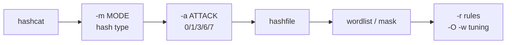

# Hashcat

> **What this covers —** The full **hashcat** workflow: attack modes (`-a`), the common `-m` mode numbers, masks, rules, tuning, and status/restore. For CPU-side cracking and file extraction, see John the Ripper.

Hashcat is **GPU-first**: it excels at fast/salted digests (MD5, SHA-x, NTLM, WPA) at enormous candidate rates. Pin the correct `-m` (hash type) and `-a` (attack mode) on every run.

## Table of Contents

1. [Command Anatomy](#1-command-anatomy)
2. [Attack Modes (`-a`)](#2-attack-modes--a)
3. [Common Hash Modes (`-m`)](#3-common-hash-modes--m)
4. [Mask Attack Reference](#4-mask-attack-reference)
5. [Rules](#5-rules)
6. [Tuning & Performance](#6-tuning--performance)
7. [Status, Restore & Output](#7-status-restore--output)
8. [Questions & Answers](#8-questions--answers)
9. [Alternative Approaches & Modern Tooling](#9-alternative-approaches--modern-tooling)

## 1. Command Anatomy



```bash
hashcat -m 1000 -a 0 ntlm.txt rockyou.txt -r best64.rule -O -w 3
#         │        │    │        │           │            │  └ workload profile
#         │        │    │        │           └ rules file  └ optimised kernel
#         │        │    │        └ wordlist / mask
#         │        │    └ hash file
#         │        └ attack mode
#         └ hash type (mode)
```

## 2. Attack Modes (`-a`)

| `-a` | Mode | What it does |
| :-- | :-- | :-- |
| `0` | Straight | Wordlist (optionally + rules). The default. |
| `1` | Combination | Concatenate every word of list A with every word of list B |
| `3` | Brute-force / Mask | Try candidates matching a mask pattern |
| `6` | Hybrid Wordlist + Mask | `word` then appended mask (e.g. `pass` + `?d?d?d`) |
| `7` | Hybrid Mask + Wordlist | mask then prepended word |
| `9` | Association | One-hash-to-one-candidate (usernames, hints) |

```bash
hashcat -m 0 -a 0 hashes.txt rockyou.txt              # straight
hashcat -m 0 -a 1 hashes.txt left.txt right.txt       # combination
hashcat -m 0 -a 3 hashes.txt '?u?l?l?l?l?d?d'         # mask
hashcat -m 0 -a 6 hashes.txt rockyou.txt '?d?d?d'     # word + 3 digits
hashcat -m 0 -a 7 hashes.txt '?d?d?d' rockyou.txt     # 3 digits + word
```

## 3. Common Hash Modes (`-m`)

The most frequent ones on HTB/CPTS boxes and real engagements. Use `hashcat --help | grep -i <name>` for anything not listed here.

| `-m` | Hash type | John equiv (`--format=`) |
| --: | :-- | :-- |
| `0` | MD5 | `raw-md5` |
| `100` | SHA1 | `raw-sha1` |
| `1400` | SHA2-256 | `raw-sha256` |
| `1700` | SHA2-512 | `raw-sha512` |
| `900` | MD4 | `raw-md4` |
| `500` | md5crypt `$1$` | `md5crypt` |
| `1800` | sha512crypt `$6$` | `sha512crypt` |
| `7400` | sha256crypt `$5$` | `sha256crypt` |
| `3200` | bcrypt `$2*$` | `bcrypt` |
| `1000` | NTLM | `nt` |
| `3000` | LM | `lm` |
| `5500` | NetNTLMv1 | `netntlm` |
| `5600` | NetNTLMv2 | `netntlmv2` |
| `1100` | DCC (MS Cache) | `mscash` |
| `2100` | DCC2 (MS Cache 2) | `mscash2` |
| `18200` | Kerberos AS-REP | `krb5asrep` |
| `13100` | Kerberos TGS-REP | `krb5tgs` |
| `19700` | Kerberos TGS-REP (AES256) | — |
| `22000` | WPA-PBKDF2-PMKID+EAPOL | `wpapsk` |
| `16500` | JWT (HS256/384/512) | — |
| `13400` | KeePass 1/2 | `keepass` |
| `11600` | 7-Zip | `7z` |
| `13600` | WinZip | `zip` |
| `12500` | RAR3 | `rar` |
| `13000` | RAR5 | `rar5` |
| `10500` | PDF 1.4-1.6 | `pdf` |
| `9600` | Office 2013 | `office` |
| `22911` | SSH RSA/DSA key | `ssh` |

```bash
hashcat -m 13100 -a 0 kerberoast.txt rockyou.txt    # Kerberoasting
hashcat -m 22000 -a 0 handshake.hc22000 rockyou.txt # WPA2
hashcat -m 1000  -a 3 ntlm.txt '?a?a?a?a?a?a?a?a'   # 8-char NTLM brute
```

> **Tip — identify the mode fast.** `hashid -m '<hash>'` prints the matching hashcat `-m` number. `hashcat --identify hashes.txt` (newer builds) lists candidate modes for a file directly.

## 4. Mask Attack Reference

| Token | Charset |
| :-- | :-- |
| `?l` | `abcdefghijklmnopqrstuvwxyz` |
| `?u` | `ABCDEFGHIJKLMNOPQRSTUVWXYZ` |
| `?d` | `0123456789` |
| `?s` | special chars ``!"#$%&'()*+,-./:;<=>?@[\]^_`{|}~`` |
| `?a` | `?l?u?d?s` (all printable ASCII) |
| `?b` | `0x00–0xff` (raw bytes) |
| `?h` / `?H` | hex `0-9a-f` / `0-9A-F` |

```bash
# Fixed length 8, first upper then lowers then 2 digits
hashcat -m 0 -a 3 hashes.txt '?u?l?l?l?l?l?d?d'

# Custom charset in slot 1 (-1), then use ?1
hashcat -m 0 -a 3 hashes.txt -1 '?l?d' '?1?1?1?1?1?1'

# Incrementing length brute force (1..8 chars of ?a)
hashcat -m 0 -a 3 --increment --increment-min=1 --increment-max=8 hashes.txt '?a?a?a?a?a?a?a?a'
```

## 5. Rules

```bash
hashcat -m 0 -a 0 hashes.txt rockyou.txt -r /usr/share/hashcat/rules/best64.rule
hashcat -m 0 -a 0 hashes.txt rockyou.txt -r rules/dive.rule            # huge
hashcat -m 0 -a 0 hashes.txt rockyou.txt -r r1.rule -r r2.rule         # stack rules

# Generate random rules on the fly
hashcat -m 0 -a 0 hashes.txt rockyou.txt -g 10000                      # 10k random rules
```

Popular built-in rule files (in `/usr/share/hashcat/rules/`): `best64.rule` (fast, high-value), `rockyou-30000.rule`, `dive.rule` (exhaustive), `OneRuleToRuleThemAll.rule` (community favourite, add manually).

## 6. Tuning & Performance

```bash
-O                    # optimised kernel (faster, caps password length ~31 — usually fine)
-w 1|2|3|4            # workload profile: 3 = desktop default, 4 = headless/dedicated
--force               # ignore warnings (use sparingly; can mask real GPU issues)
-D 1                  # use CPU devices;  -D 2 = GPU only
-d 1                  # select device 1 (see hashcat -I for device list)
--status --status-timer=10   # periodic status lines every 10s
hashcat -b                    # benchmark all modes
hashcat -b -m 1000            # benchmark just NTLM
```

> **Warning — `-O` trades length for speed.** The optimised kernel limits candidate length (≈31 for most modes). For long passphrases (WPA, KeePass) drop `-O` so you don't silently skip valid candidates.

## 7. Status, Restore & Output

```bash
# Live keys during a run:  s = status, p = pause, r = resume, b = bypass, q = quit
hashcat -m 1000 -a 0 ntlm.txt rockyou.txt --session=job1        # named session
hashcat --session=job1 --restore                               # resume after stop

hashcat -m 1000 ntlm.txt rockyou.txt --potfile-path=/tmp/x.pot # custom pot
hashcat -m 1000 ntlm.txt --show                                # show cracked (from pot)
hashcat -m 1000 ntlm.txt --left                                # show still-uncracked
hashcat -m 1000 -a 0 ntlm.txt rockyou.txt -o cracked.txt       # write results to file
hashcat -m 1000 -a 0 ntlm.txt rockyou.txt --outfile-format=2   # 2 = plain only
```

## 8. Questions & Answers

### Q: How do I crack a Kerberoast TGS hash?
```bash
hashcat -m 13100 -a 0 spns.txt /usr/share/wordlists/rockyou.txt -O
```
**Answer:** mode `13100`, straight attack. AS-REP roast uses `18200`.

### Q: How do I crack an NTLM hash dumped from a DC?
```bash
hashcat -m 1000 -a 0 ntlm.txt rockyou.txt -r best64.rule
```
**Answer:** mode `1000`. NetNTLMv2 from Responder = `5600`.

### Q: How do I brute-force an 8-character all-ASCII password?
```bash
hashcat -m 1000 -a 3 ntlm.txt '?a?a?a?a?a?a?a?a' -O -w 3
```
**Answer:** mask attack (`-a 3`) with eight `?a` tokens.

### Q: How do I crack a WPA2 handshake?
```bash
hcxpcapngtool -o handshake.hc22000 capture.pcapng     # convert
hashcat -m 22000 -a 0 handshake.hc22000 rockyou.txt   # crack
```
**Answer:** convert to `.hc22000` then mode `22000`.

## 9. Alternative Approaches & Modern Tooling

> **Tip — use the right tool per hash.** **Hashcat** wins on GPU-friendly hashes (raw MD5/SHA, NTLM, WPA, Kerberos). **John** wins on file extraction (`*2john`), `--single` username mangling, and formats hashcat lacks. Identify with `hashid`, then choose.

> **Note — `22000` replaces `2500`/`16800`.** Mode `22000` (PMKID+EAPOL) is the current unified WPA mode. The older `2500` (`.hccapx`) and `16800` (PMKID-only) are deprecated — always convert captures with `hcxpcapngtool` to `.hc22000`.

> **Warning — wordlist + rules beats pure brute-force.** A rules run over `rockyou.txt` (`-r OneRuleToRuleThemAll.rule`) covers vastly more realistic passwords per second than a blind `?a?a?a?a…` mask. Reach for masks only when you know the password structure.
