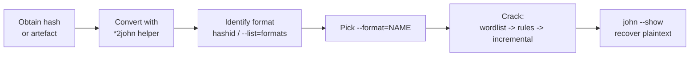
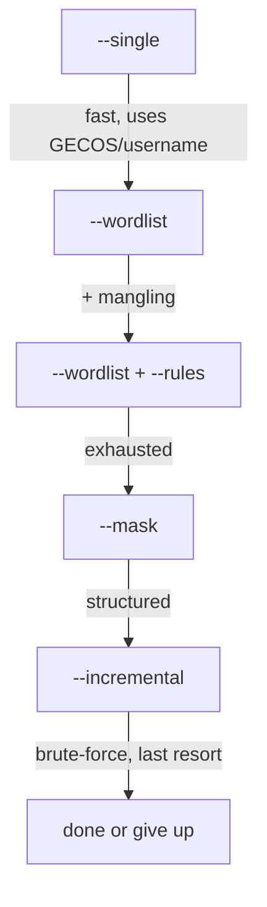

# John the Ripper

> **What this covers —** Full workflow for **John the Ripper (Jumbo)**: identifying a hash, picking the correct `--format=` value for every hash type, preparing hashes with the `*2john` helpers, and every cracking mode flag. For the GPU-heavy equivalents see Hashcat.

Use **John the Ripper Jumbo** (`john-jumbo`, the community build shipped on Kali/Parrot). The stock upstream build supports far fewer formats. All commands below assume the Jumbo build.

## Table of Contents

1. [Quick Workflow](#1-quick-workflow)
2. [Identifying the Hash](#2-identifying-the-hash)
3. [`--format=` Flag for Every Hash Type](#3-format-flag-for-every-hash-type)
4. [Preparing Hashes — the `*2john` Helpers](#4-preparing-hashes--the-2john-helpers)
5. [Cracking Mode Flags](#5-cracking-mode-flags)
6. [Rules, Masks & Tuning](#6-rules-masks--tuning)
7. [Session, Output & Status Flags](#7-session-output--status-flags)
8. [Questions & Answers](#8-questions--answers)
9. [Alternative Approaches & Modern Tooling](#9-alternative-approaches--modern-tooling)

## 1. Quick Workflow



```bash
# The canonical three-liner
zip2john secret.zip > hash.txt                 # 1. convert artefact -> john hash
john --format=zip --wordlist=rockyou.txt hash.txt   # 2. crack
john --show --format=zip hash.txt              # 3. reveal cracked passwords
```

> **Tip — cracked passwords live in `~/.john/john.pot`.** John never re-cracks a hash it has already solved. `--show` reads from the pot file. To force a fresh run, delete or point away from the pot: `--pot=/tmp/fresh.pot`.

## 2. Identifying the Hash

```bash
# Best-effort identification (installed as `hashid` or `hash-identifier`)
hashid '$6$rounds=5000$abc$...'
hashid -m 'hash'                 # also prints the matching hashcat -m mode

# List every format John supports (grep for what you need)
john --list=formats
john --list=formats | tr ',' '\n' | grep -i ntlm

# Show the subformats/notes for one format
john --list=format-details --format=krb5tgs
```

> **Warning — `hashid` guesses, it does not confirm.** Multiple algorithms share a length/shape (e.g. raw MD5 vs NTLM vs raw-MD4 are all 32 hex chars). If the first `--format` fails, try the siblings in the table below before assuming the hash is wrong.

## 3. `--format=` Flag for Every Hash Type

The value passed to `--format=` is John's internal format name, **not** a hashcat mode number. Below are the ones you will actually meet on HTB/CPTS boxes and real engagements. Names are case-insensitive.

### Raw / unsalted digests

| Hash type | `--format=` | Notes |
| :-- | :-- | :-- |
| MD5 (raw) | `raw-md5` | 32 hex |
| MD4 (raw) | `raw-md4` | 32 hex |
| SHA-1 | `raw-sha1` | 40 hex |
| SHA-224 | `raw-sha224` | |
| SHA-256 | `raw-sha256` | 64 hex |
| SHA-384 | `raw-sha384` | |
| SHA-512 | `raw-sha512` | 128 hex |
| SHA3-256 / 512 | `raw-sha3` | |
| RIPEMD-160 | `ripemd-160` | |
| Whirlpool | `whirlpool` | |
| BLAKE2b-512 | `raw-blake2` | |
| GOST R 34.11-94 | `gost` | |

### OS / login hashes

| Hash type | `--format=` | Notes |
| :-- | :-- | :-- |
| DES crypt (traditional) | `descrypt` | 13 chars |
| MD5 crypt `$1$` | `md5crypt` | Linux/BSD, Cisco-IOS |
| bcrypt `$2a$`/`$2b$`/`$2y$` | `bcrypt` | very slow, GPU-resistant |
| SHA-256 crypt `$5$` | `sha256crypt` | Linux |
| SHA-512 crypt `$6$` | `sha512crypt` | modern Linux `/etc/shadow` |
| scrypt `$7$` | `scrypt` | |
| Argon2 | `argon2` | i / id / d variants |
| Apache `$apr1$` | `md5crypt` (or `apache-md5`) | htpasswd MD5 |
| AIX smd5 / ssha | `aix-smd5` / `aix-ssha256` | |
| macOS 10.8+ | `pbkdf2-hmac-sha512` | via `ml2john` |

### Windows / Active Directory

| Hash type | `--format=` | Notes |
| :-- | :-- | :-- |
| NTLM (NT hash) | `nt` | AD user hash, 32 hex |
| LM (legacy) | `lm` | |
| NetNTLMv1 | `netntlm` | Responder capture |
| NetNTLMv2 | `netntlmv2` | Responder capture (most common) |
| MS-Cache v1 (DCC) | `mscash` | |
| MS-Cache v2 (DCC2) | `mscash2` | domain cached creds |
| Kerberos AS-REP (roast) | `krb5asrep` | from `GetNPUsers.py` |
| Kerberos TGS (roast) | `krb5tgs` | from `GetUserSPNs.py` |
| Kerberos pre-auth (etype 23) | `krb5pa-md5` | |
| DPAPI masterkey | `dpapimk` | |

### Databases

| Hash type | `--format=` | Notes |
| :-- | :-- | :-- |
| MySQL ≤ 4.0 | `mysql` | 16 hex |
| MySQL 4.1+/5+ | `mysql-sha1` | leading `*` |
| PostgreSQL MD5 | `postgres` | |
| MSSQL 2000 | `mssql` | |
| MSSQL 2005 | `mssql05` | |
| MSSQL 2012/2014 | `mssql12` | |
| Oracle 7-10g | `oracle` | |
| Oracle 11g | `oracle11` | |
| Oracle 12c | `oracle12c` | |
| MongoDB SCRAM-SHA-1 | `mongodb` | |

### Apps, archives & files

| Hash type | `--format=` | Prepare with |
| :-- | :-- | :-- |
| ZIP (classic/AES) | `zip` / `pkzip` | `zip2john` |
| RAR3 / RAR5 | `rar` / `rar5` | `rar2john` |
| 7-Zip | `7z` | `7z2john` |
| PDF | `pdf` | `pdf2john` |
| Office 2007-2013+ | `office` | `office2john` |
| Old Office (97-2003) | `oldoffice` | `office2john` |
| OpenDocument | `odf` | `odf2john` |
| KeePass 1/2 | `keepass` | `keepass2john` |
| SSH private key | `ssh` | `ssh2john` |
| GPG/PGP secret key | `gpg` | `gpg2john` |
| LUKS | `luks` | `luks2john` |
| BitLocker | `bitlocker` | `bitlocker2john` |
| macOS keychain | `keychain` | `keychain2john` |
| Bitcoin/Ethereum wallet | `bitcoin` / `ethereum` | `bitcoin2john` / `ethereum2john` |
| WPA/WPA2 handshake | `wpapsk` | `hcxpcapngtool` then `wpapcap2john` |
| htpasswd (bcrypt) | `bcrypt` | already a hash |
| JWT (HS256 etc.) | `HMAC-SHA256` | strip and format manually, or use hashcat `-m 16500` |

> **Note — formatting upgrade.** Store the `--format=` value in your notes **next to the artefact type**, not the hash string. On a real box you rarely know the algorithm until you have run the `*2john` helper — the helper output line usually starts with `$name$`, which tells you the format immediately (e.g. `$krb5tgs$23$...` → `--format=krb5tgs`).

## 4. Preparing Hashes — the `*2john` Helpers

Most non-trivial targets are not bare hashes; they are files or captures. The `*2john` scripts extract a crackable hash string. Run `ls /usr/share/john/*2john*` and `ls /usr/bin/*2john` to see what is installed.

```bash
ssh2john id_rsa            > ssh.hash
zip2john archive.zip       > zip.hash
rar2john archive.rar       > rar.hash
7z2john archive.7z         > 7z.hash        # may be 7z2john.pl
pdf2john secret.pdf        > pdf.hash
office2john report.docx    > office.hash
keepass2john Database.kdbx > kp.hash
gpg2john secret.gpg        > gpg.hash
```

```bash
# Then crack — format is often auto-detected, but pin it to be safe:
john --wordlist=/usr/share/wordlists/rockyou.txt --format=ssh ssh.hash
```

## 5. Cracking Mode Flags



| Flag | Mode | Use when |
| :-- | :-- | :-- |
| `--single` | Single crack | Fast first pass; derives candidates from the username/GECOS fields in the hash file |
| `--wordlist=FILE` | Dictionary | You have a wordlist (default go-to) |
| `--wordlist=FILE --rules` | Dictionary + mangling | Apply word-mangling rules (see below) |
| `--incremental[=MODE]` | Brute-force | Wordlists exhausted; `MODE` = `ASCII`, `Digits`, `Alpha`, `LM_ASCII`… |
| `--mask=?u?l?l?l?d?d` | Mask/brute | You know the password pattern |
| `--external=NAME` | External | Custom C-like generators in `john.conf` |
| `--loopback` | Loopback | Feed already-cracked passwords back as a wordlist |
| `--prince=FILE` | PRINCE | Combinator-style candidate generation |

```bash
# Classic escalating attack on a shadow file
john --single passwd.hash
john --wordlist=rockyou.txt passwd.hash
john --wordlist=rockyou.txt --rules=Jumbo passwd.hash
john --incremental passwd.hash
```

> **Tip — combine `--single` first, it is free.** `--single` runs in seconds and catches passwords derived from the username (e.g. user `admin` → `admin123`, `Admin!`). Always run it before touching a wordlist.

## 6. Rules, Masks & Tuning

```bash
# Built-in rule sets (defined in /etc/john/john.conf)
john --wordlist=rockyou.txt --rules=Single   hash.txt
john --wordlist=rockyou.txt --rules=Jumbo    hash.txt   # large, thorough
john --wordlist=rockyou.txt --rules=KoreLogic hash.txt

# Mask attack — placeholders:
#   ?l lower  ?u upper  ?d digit  ?s special  ?a all  ?h/?H hex
john --mask='?u?l?l?l?l?d?d' hash.txt
john --mask='Summer?d?d?d?d' hash.txt          # e.g. Summer2024

# Hybrid: wordlist + appended mask
john --wordlist=rockyou.txt --mask='?w?d?d?d' hash.txt   # word + 3 digits

# Fork across CPU cores (Jumbo)
john --fork=4 --wordlist=rockyou.txt hash.txt

# Limit runtime / candidate count
john --wordlist=rockyou.txt --max-run-time=300 hash.txt
```

## 7. Session, Output & Status Flags

```bash
john --show hash.txt                    # print cracked plaintexts
john --show --format=nt hash.txt        # pin format when showing
john --show=left hash.txt               # show still-uncracked hashes

john --session=engagement hash.txt      # named session (resumable)
john --restore=engagement               # resume it after Ctrl-C / crash
john --status=engagement                # check progress of a running session

# During a live run: press any key for a status line, 'q' to quit gracefully

john --pot=/tmp/custom.pot hash.txt     # use an alternate pot file
john --list=formats                     # all supported formats
john --test --format=sha512crypt        # benchmark one format (speeds)
```

## 8. Questions & Answers

### Q: Which `--format` do I use for a Kerberoast hash from `GetUserSPNs.py`?
**Approach:** The output line begins with `$krb5tgs$23$...`.
```bash
john --format=krb5tgs --wordlist=rockyou.txt spns.txt
```
**Answer:** `krb5tgs`. For AS-REP roasting (`GetNPUsers.py`, `$krb5asrep$…`) use `krb5asrep`.

### Q: I have `/etc/shadow` with `$6$` hashes. What format, and how do I combine passwd + shadow?
**Approach:** `$6$` = sha512crypt. Merge the files first with `unshadow`.
```bash
unshadow /etc/passwd /etc/shadow > unshadowed.txt
john --format=sha512crypt --wordlist=rockyou.txt unshadowed.txt
```
**Answer:** `sha512crypt` (running `unshadow` first lets `--single` use the usernames).

### Q: How do I crack an NTLM hash dumped from a DC?
```bash
john --format=nt --wordlist=rockyou.txt ntlm.txt
```
**Answer:** `nt`. NetNTLMv2 captures from Responder use `netntlmv2` instead.

### Q: How do I benchmark how fast John cracks a given hash type?
```bash
john --test --format=bcrypt      # prints c/s (candidates per second)
```
**Answer:** `--test` (add `--format=` to benchmark just one; omit for all).

## 9. Alternative Approaches & Modern Tooling

> **Tip — move salted-but-fast hashes to a GPU.** John is CPU-first. For raw MD5/SHA/NTLM and other GPU-friendly algorithms, **hashcat** on a GPU is often 10–100× faster. Keep John for formats hashcat lacks and for its superb `*2john` extractors and `--single`/rules ergonomics.

> **Note — `hashid` → mode mapping.** `hashid -m` prints the matching **hashcat** `-m` number. There is no clean one-liner mapping to John format names, so keep the table in §3 as your lookup.

> **Warning — prefer `hcxpcapngtool` for Wi-Fi.** The older `wpapcap2john` path is fragile with modern captures. Convert with `hcxpcapngtool` (from `hcxtools`) to a `.hc22000` and crack in hashcat `-m 22000`, which is the current standard for WPA/WPA2/WPA3-SAE.
